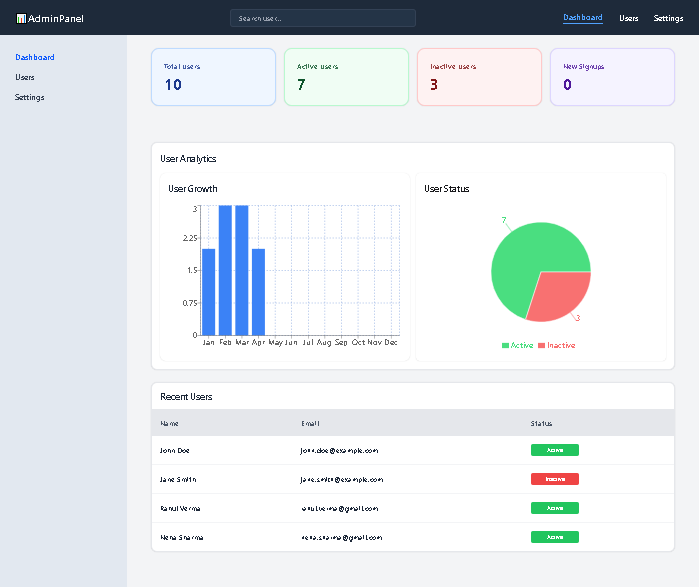
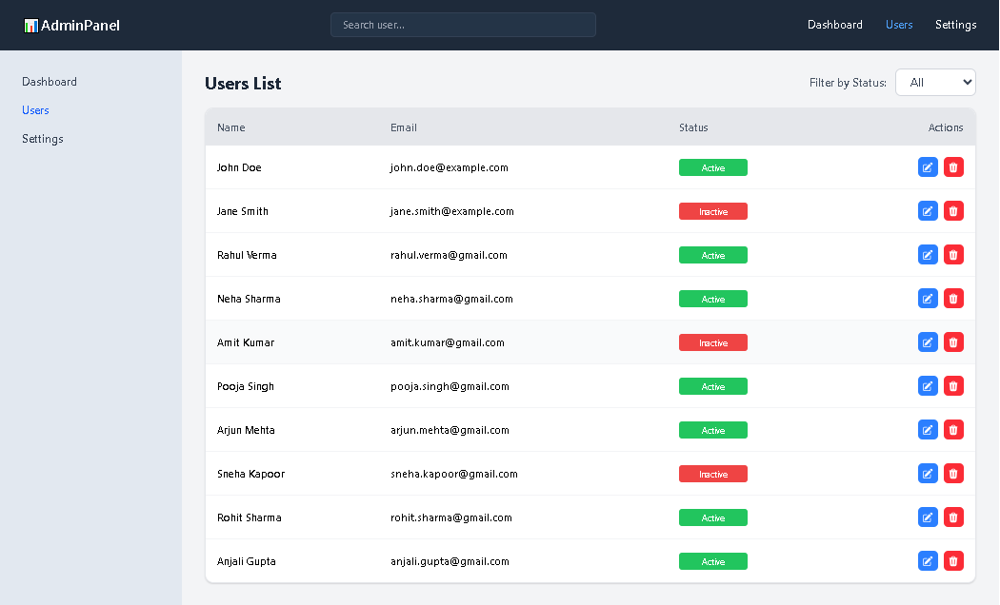
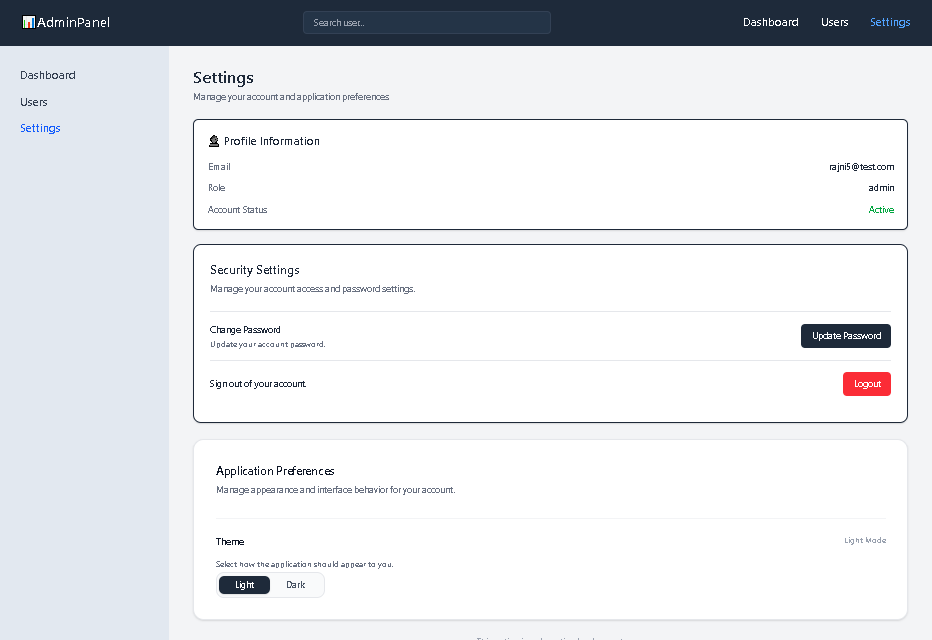
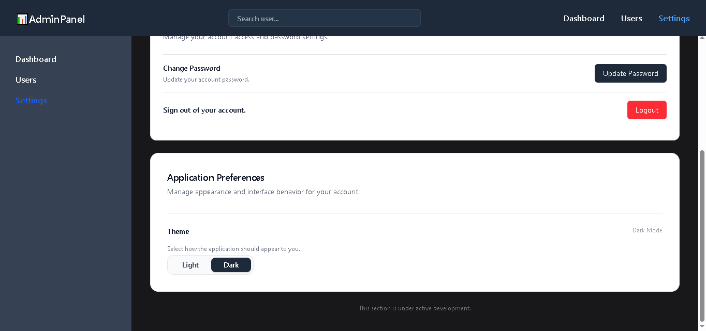
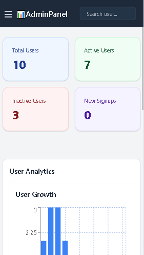

# 🚀 Admin Dashboard - Full Stack MERN Project

A professional, high-performance **MERN Stack** Admin Dashboard designed for secure user management and real-time data analytics. This project simulates a real-world SaaS panel with a focus on **Responsive UI**, **Security**, and **Scalability**.

---

## 🔗 Links

**[👉Live project Link](https://admin-dashboard-sooty-one-90.vercel.app/)**

---

## 📸 Project Previews

|                              📊 Full Dashboard View                               |                          👥 User Management Page                           |
| :-------------------------------------------------------------------------------: | :------------------------------------------------------------------------: |
|  |       |
|                               **⚙️ Admin Settings**                               |                           **🌓 Dark Theme Mode**                           |
|        |  |

### 📱 Mobile Responsiveness

|                           Dashboard Mobile View                           |
| :-----------------------------------------------------------------------: |
|  |

---

## ✨ Key Features

- **🔐 Secure Authentication**: Admin-only access using **JWT (JSON Web Tokens)** and password hashing with **bcrypt**.
- **📊 Interactive Analytics**: Real-time data visualization using **Recharts**, including:
  - **User Growth Chart**: Tracks registrations over time.
  - **User Status Distribution**: Pie chart for Active vs. Inactive users.
- **💾 Data Seeding** : Implemented custom scripts to populate realistic user data for demo purposes.
- **👥 Complete User Management (CRUD)**:
  - Edit and Delete users.
  - Toggle user status and view recent signups.
- **🔍 Advanced Search & Filter**: Quickly find users by Name/Email or filter by status.
- **📱 Fully Responsive**: Optimized for all devices (**Mobile-first approach, 360px+ support**).
- **Theme Switching:** Persistent Dark/Light mode support.
- **🛡️ Protected Routes**: Ensures only authenticated admins can access dashboard data.

---

## 🛠️ Tech Stack

### 💻 Frontend

- **React.js**: Component-based UI architecture.
- **Redux Toolkit**: Global state management (Slices & Async Thunks).
- **Tailwind CSS**: Utility-first styling for a modern look.
- **React Router**: Client-side routing for seamless navigation.
- **Recharts**: Data visualization and charts.

### ⚙️ Backend

- **Node.js & Express.js**: Scalable RESTful API development.
- **MongoDB**: NoSQL database for flexible data storage.
- **Mongoose**: Structured Object Data Modeling (ODM).

---

## 🏗️ Architecture & Design

### 🔑 Admin Access Design

For maximum security, **admin registration is not public**. Admin accounts are managed manually via the database to prevent unauthorized access.

### 📁 Project Structure

The project follows a modular structure:

- **Frontend**: Handles UI, State Management, and API Integration.
- **Backend**: Manages Business Logic, Authentication, and Database Operations.

---

## 🚀 Getting Started

1. **Clone the repo**

   ```bash
   git clone [https://github.com/rajni18/admin-dashboard.git](https://github.com/rajni18/admin-dashboard.git)

   ```

2. **Setup Backend**
   cd backend
   npm install
   npm start

3. **Setup Frontend**
   cd frontend
   npm install
   npm run dev
